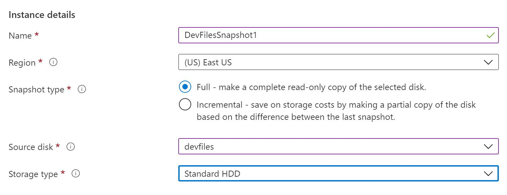

# Deploy Workloads on an Azure Virtual Machine

# Challenge Overview
## Understand the scenario

You are an Azure® developer. You need to create an image of an Azure virtual machine that hosts Microsoft Visual Studio®. First, you will create a virtual machine, and then you will add a data disk to the virtual machine. Next, you will capture an image of a generalized version of the virtual machine in Azure. Finally, you will create a virtual machine from the image, and then you will create a snapshot of a data disk.

## Understand your environment

You will be using an Azure resource group named **RG-Challenge04**

# Create an Azure virtual machine that hosts Visual Studio
- Sign in to the Azure portal as as your user account and password.

- Create an Azure virtual machine based on the **Visual Studio Community 2017 on Windows Server 2016 (x64)** image by using the values in the following table. For any property that is not specified, use the default value.

  | Property             | Value                                                        |
  | :------------------- | :----------------------------------------------------------- |
  | Resource group       | **RG-Challenge04**                                           |
  | Virtual machine name | **VM1**                                                      |
  | Region               | **(US) East US**                                             |
  | Image                | **Visual Studio Community 2017 on Windows Server 2016 (x64) - Gen1** |
  | Size                 | **Standard_B2ms**                                            |
  | Username             | **AzureAdmin**                                               |
  | **Password**         | **AzurePassw0rd!**                                           |
  | Public inbound ports | **Allow selected ports**                                     |
  | Select inbound ports | **RDP (3389)**                                               |
  | License type         | **Windows server**                                           |
  | OS disk type         | **Standard HDD**                                             |
  | Boot diagnostics     | **Disable**                                                  |

- Connect to **VM1** by using **RDP**, and then when prompted, sign in as **AzureAdmin** using **AzurePassw0rd!** as the password.

- Open **Visual Studio 2017**, sign in with your user and password to verify that Visual Studio is available, and then close Visual Studio.

​		It will take a few minutes for Visual Studio 2017 to open for the first time.

- Minimize the **Remote Desktop Connection** window, and then switch to the Azure portal.

## Check your work

- [ ] Confirm that you created an Azure virtual machine named **VM1**.
- [ ] Confirm that you connected to **VM1** by using RDP.
- [ ] Confirm that you signed in to **Visual Studio 2017** in the virtual machine.

# Add a data disk to the virtual machine

- Create a new disk named DevFiles that is attached to **VM1**, and then configure the disk by using the **Standard HDD** OS disk type and a size of 128 GiB.

- In the Remote Desktop Connection window, initialize the new disk as a simple volume by using the drive letter **F**, the **NTFS** file system, and a volume label of DevFiles. 

  - In the Remote Desktop Connection window, right-click Start, and then select Disk Management.

  - In the Initialize Disk dialog box, review the default values, and then select OK to initialize the new disk.

	

  - In Disk Management, right-click the new, unallocated disk, and then select **New Simple Volume**.

	

    - In the New Simple Volume Wizard, select **Next** twice to advance to the Assign Drive Letter or Path page.
    - In Assign the following drive letter, ensure that **F** is selected, and then select **Next**.
    - In File System, ensure that **NTFS** is selected, and then in Volume label, enter DevFiles,
    - Select **Next**, and then select **Finish** to format the new disk.
    - Close **Disk Management**.

- Verify that the **DevFiles (F:)** disk volume is available by using File Explorer, and then create a folder named **F:\DevFiles**. .

- Keep the Remote Desktop Connection window open for the next task.

## Check your work

- [ ] Confirm that you added a new data disk named DevFiles to the virtual machine.
- [ ] Confirm that you created a new simple volume named DevFiles that uses NTFS and the drive letter F.

# Capture an image of a generalized virtual machine

- Run [sysprep](https://docs.microsoft.com/en-us/windows-hardware/manufacture/desktop/sysprep--generalize--a-windows-installation#generalize-an-image) to both generalize the virtual machine image and shut down the virtual machine.

- In the Remote Desktop Connection window, open **Windows PowerShell**.

- Run the following command to change to the sysprep folder:

    ```
    cd \windows\system32\sysprep
    ```

- Run the following command to generalize the virtual machine:

    ```
    .\sysprep.exe /oobe /generalize /mode:vm /shutdown
    ```

- In the Remote Desktop Session message box, select **OK**.

> After the *sysprep* process generalizes the virtual machine, the *sysprep* process should shut down the virtual machine, and the RDP session will close automatically.

> **Remember**: You use *Sysprep* to create a [managed image](https://docs.microsoft.com/en-us/azure/virtual-machines/windows/capture-image-resource) of a generalized virtual machine in Azure.

- Verify that VM1 has a status of **Stopped**.

> A virtual machine must be in a Stopped state before you can capture a virtual machine image.

- Capture **VM1** as a managed image named *VM1-image-[sequence]*

  - On the VM1 Overview page, on the command bar, select **Capture**.

  - On the Create an image blade, in Resource group, ensure that **RG-Challenge04** is selected.

  - In Share image to Shared image gallery, select **No, capture only a managed image**.

  - In Name, enter *VM1-image-[sequence]*, and then select **Review + create**.

  - Review the specification, and then select **Create** to capture the virtual machine image.

> It will take approximately 1–2 minutes to capture the virtual machine image.

## Check your work

- [ ] Confirm that you generalized **VM1** by using *Sysprep*.
- [ ] Confirm that you captured **VM1** as a managed image.

# Create a virtual machine from the captured image

- Create a new virtual machine that uses the captured image by using the values in the following table. For any property that is not specified, use the default value.

  | Property             | Value                           |
  | :------------------- | :------------------------------ |
  | Resource group       | **RG-Challenge04**              |
  | Name                 | **VM2**                         |
  | Image                | **VM1-image-[sequence] - Gen1** |
  | Size                 | **Standard_B2ms**               |
  | Username             | AzureAdmin                      |
  | Password             | AzurePassw0rd!                  |
  | Public inbound ports | **Allow selected ports**        |
  | Select inbound ports | **RDP (3389)**                  |
  | License type         | **Windows server**              |
  | OS disk type         | **Standard HDD**                |
  | Boot diagnostics     | **Disable**                     |

  > Use Images Services on Azure

> It will take 3–5 minutes for the new virtual machine to fully start up.

- Connect to **VM2** by using **RDP**, and then when prompted, sign in as AzureAdmin using AzurePassw0rd! as the password.

- Connect to **VM2** by using **RDP**, and then when prompted, sign in as AzureAdmin using AzurePassw0rd! as the password.

  > The DevFiles drive may be allocated a different drive letter from the original virtual machine.

- Close the **Remote Desktop Connection** window.

## Check your work

- [ ] Confirm that you created a virtual machine named **VM2** by using the captured image.
- [ ] Confirm that you connected to **VM2** to verify that it contains the same configuration as the original virtual machine.

# Create a snapshot of a data disk

- Create a snapshot by using the values in the following table. For any property that is not specified, use the default value.

    | Property       | Value                    |
    | :------------- | :----------------------- |
    | Resource group | **RG-Challenge04**       |
    | Name           | DevFilesSnapshot1        |
    | Source disk    | **devfiles**             |
    | Storage type   | **Standard HDD**         |

- On the Azure portal home page, select **Create a resource** to display the Azure Marketplace.
- In the Azure Marketplace, search for and select Snapshot.
- On the Snapshot page, select **Create**.
	
- On the Create snapshot blade, in Resource group, select **RG-Challenge04**, and then in Name, enter **DevFilesSnapshot1.**

- In Source disk, select **devfiles**, and then in Storage type, select **Standard HDD**.
	
- On the Create snapshot blade, select Review + create, review the configuration, and then select Create to create the snapshot.
	

> **Remember**: By creating a [snapshot](https://docs.microsoft.com/en-us/azure/virtual-machines/windows/snapshot-copy-managed-disk), you can make a read-only copy of a disk that you can use for instant backup and recovery purposes.

## Check your work

- [ ] Confirm that you created a snapshot named DevFilesSnapshot1 that is based on the DevFiles data disk.

# Summary

Congratulations, you have completed the **Deploy Workloads on an Azure Virtual Machine** challenge.

You have accomplished the following:

- Created a virtual machine that contains Visual Studio.
- Added a data disk to a virtual machine.
- Captured an image of a generalized virtual machine.
- Created a virtual machine from a captured image.
- Created a snapshot of a data disk.

