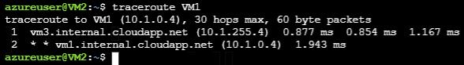

# Configure Route Tables in a Virtual Network


## Challenge Overview
## Understand the scenario
You are an Azure® administrator responsible for managing an Azure virtual network. You need to ensure that all traffic between the front-end and back-end subnets of the virtual network are routed through a firewall virtual appliance. First, you will create the route tables and routes, and then you will then associate them to the subnets. Next, you will enable IP forwarding on the virtual appliance. Finally, you will verify that traffic is being routed through the virtual appliance.

## Understand your environment
You will be creating an Azure resource group named **RG-05** that contains a storage account named **sa[Initials]**, a virtual network named **app-vnet**, and three virtual machines named **VM1**, **VM2**, and **VM3**.

> Important: **do not start** until these resources have been created, you will not be guided through these tasks. 

# Record the IP addresses of existing virtual machines

Sign in to the Azure portal as as your user account and password.

Record the **public IP address** of **VM2** in the following **VM2 Public IP Address** text box:

**VM2 Public IP Address**

```
```

>You will use the public IP addresses of VM2 in an upcoming task. VM2 has a private IP address of 10.1.1.4 and is located in a subnet named backend in a virtual network named app-vnet.

- Record the **public IP address** of **VM3** in the following **VM3 Public IP Address** text box:

**VM3 Public IP Address**

```
```

> You will use the public IP addresses of VM3 in an upcoming task. VM3 has a private IP address of 10.1.255.4 and is located in a subnet named dmz in a virtual network named app-vnet. VM3 will be used as a virtual appliance in this challenge.


## Check your work
- [ ] Confirm that you recorded the public IP addresses of VM2 and VM3.

# Configure a front-end route table

- Create a route table named app-frontend-rt by using the **RG5** resource group and the **East US** region, and then disable gateway route propagation.

  - In the upper-left corner, select **Home** to return to the Azure portal home page, and then select **Create a resource**.

  - In the Azure Marketplace, search for and select Route table, and then select **Create**.

  - In Resource group, select **RG5**.

  - In Region, ensure that **East US** is selected.

  - In Name, enter app-frontend-rt.

  - In Propagate gateway routes, select **No**, and then select **Review + create**.

  - Review the configuration, and then select **Create**.

> Remember: You can create a route table by using the [Azure portal](https://docs.microsoft.com/en-us/azure/virtual-network/tutorial-create-route-table-portal), the [New-AzRouteTable](https://docs.microsoft.com/en-us/powershell/module/az.network/new-azroutetable) PowerShell® cmdlet, or the [az network route-table](https://docs.microsoft.com/en-us/cli/azure/network/route-table?view=azure-cli-latest#az-network-route-table-create) Azure command-line interface (CLI) 2.0 command.

- Add a route named to-backend to the **app-frontend-rt** route table, and then configure the route by using an address prefix of 10.1.1.0/24 and a **Virtual appliance** next hop address of 10.1.255.4.

  - On the Deployment page, select **Go to resource**.

  - On the app-frontend-rt resource menu, in Settings, select **Routes**, and then on the command bar, select **Add**.

  - In Route name, enter to-backend.

  - In Address prefix, enter 10.1.1.0/24.

  - In Next hop type, select **Virtual appliance**.

  - In Next hop address, enter 10.1.255.4, and then select **OK**.

> Remember: You can add a [route](https://docs.microsoft.com/en-us/azure/virtual-network/virtual-networks-udr-overview) to a route table by using the Azure portal, or by using the [Get-AzRouteTable](https://docs.microsoft.com/en-us/powershell/module/az.network/get-azroutetable), [Add-AzRouteConfig](https://docs.microsoft.com/en-us/powershell/module/az.network/add-azrouteconfig), and [Set-AzRouteTable](https://docs.microsoft.com/en-us/powershell/module/az.network/set-azroutetable) cmdlets. You can also use the [az network route-table route](https://docs.microsoft.com/en-us/cli/azure/network/route-table/route?view=azure-cli-latest#az-network-route-table-route-create) command to add a route to a route table.

- Associate the **app-frontend-rt** route table to the **frontend** subnet in the **app-vnet** virtual network.

  - On the app-frontend-rt resource menu, in Settings, select **Subnets**.

  - On the command bar, select **Associate**.

  - In the Associate subnet blade, in Virtual network, select **app-vnet**, in Subnet, select **frontend**, and then select **OK**.

> Remember: You can associate a route to a subnet by using the Azure portal, the [Set-AzVirtualNetworkSubnetConfig](https://docs.microsoft.com/en-us/powershell/module/az.network/set-azvirtualnetworksubnetconfig) and [Set-AzVirtualNetwork](https://docs.microsoft.com/en-us/powershell/module/az.network/set-azvirtualnetwork) cmdlets, or the [az network route-table route](https://docs.microsoft.com/en-us/cli/azure/network/route-table/route?view=azure-cli-latest) command.

## Check your work

- [ ] Confirm that you created a route table named app-frontend-rt.
- [ ] Confirm that you added a route named to-backend to the app-frontend-rt route table.
- [ ] Confirm that you associated the app-frontend-rt route table to the frontend subnet.

# Configure a back-end route table

- Create a Route table named app-backend-rt that uses the **RG5** resource group and the **East US** region, and then disable gateway route propagation.
- Add a route named to-frontend to the **app-backend-rt** route table, and then configure the route by using an address prefix of 10.1.0.0/24 and a **Virtual appliance** next hop address of 10.1.255.4.
- Associate the **app-backend-rt** route table to the **backend** subnet in the **app-vnet** virtual network.

## Check your work

- Confirm that you created a route table named app-backend-rt.
- Confirm that you added a route named to-frontend to the app-backend-rt route table.
- Confirm that you associated the app-backend-rt route table to the backend subnet.

# Enable IP forwarding on the virtual appliance

- Configure an Azure Cloud Shell **Bash** session by using the existing **RG-Challenge06cs** resource group, the existing **cloudshsa[your initials]** storage account in the **East US** region, and a new file share named cloud-shell-share.

  - On the Azure portal toolbar, select the **Cloud Shell** icon.

  In the Cloud Shell window, select **Bash**, and then select **Show advanced settings**.

  - In Cloud Shell region, ensure that **East US** is selected.
  - In Resource group, ensure that **Use existing** is selected, and then ensure that **RG-Challenge06cs** is selected.
  - In Storage account, ensure that **Use Existing** is selected, and then ensure that **cloudshsa[your initials]** is selected.
  - In File share, ensure that **Create new** is selected, and then enter cloud-shell-share.
  - Select **Create storage** to mount the storage account.

- In Cloud Shell, create a [secure shell (SSH)](https://docs.microsoft.com/en-us/azure/virtual-machines/linux/mac-create-ssh-keys#ssh-into-your-vm) connection to **VM3** by using azureuser@<PIP_VM3>, and then when prompted, enter AzurePwd28486017 as the password.

  - In Cloud Shell, run the following command to connect to the Linux virtual machine:ssh azureuser@<PIP_VM3>

  - When prompted, enter yes, and then press Enter.

  - In azureuser@<PIP_VM3>'s password, enter AzurePwd28486017, and then press Enter.

  - When prompted, enter yes, and then press Enter.

  - In azureuser@<PIP_VM3>'s password, enter AzurePwd28486017, and then press Enter.

- > Because this is a Linux virtual machine, you will not see the password displayed in Cloud Shell.

- Enable IP forwarding by using the [sudo](http://manpages.ubuntu.com/manpages/focal/en/man8/sudo.8.html) user and the [sysctl](http://manpages.ubuntu.com/manpages/focal/en/man8/sysctl.8.html) command, and then [exit](http://manpages.ubuntu.com/manpages/focal/en/man1/exit.1posix.html) the SSH connection.

  - Run the following command to enable IP forwarding:

    ```
    sudo sysctl -w net.ipv4.ip_forward=1
    ```

  - Enter exit, and then press Enter to close the SSH connection.

> Leave Cloud Shell open for the next task.

## Check your work

- Confirm that you created a Bash session in Cloud Shell.
- Confirm that you connected to VM3 by using SSH.
- Confirm that you enabled IP forwarding on VM3.

# Test routes by using the traceroute tool

- In Cloud Shell, create an SSH connection to VM2 by using azureuser@<PIP_VM2>, and then when prompted, enter AzurePwd28486017 as the password.

- In the SSH session, update the virtual machine by using the sudo [apt-get](https://manpages.ubuntu.com/manpages/precise/en/man8/apt-get.8.html) tool and the update command.

    - Run the following command to update the Linux virtual machine:

      ```
      sudo apt-get update
      ```

      > Ensure that you have updated the Linux virtual machine before moving on to the next task.

  

- Install the traceroute tool by using sudo apt and the install command.

  - Run the following command to install the traceroute tool:

  - ```
    sudo apt install traceroute
    ```

  

  - Verify that traffic sent to VM1 is routed through the virtual appliance—VM3—by using the traceroute tool, and then exit the SSH connection.


  > Your output should be similar to the following screenshot:
  >
  > 

## Check your work

- Confirm that you connected to VM2 by using SSH.
- Confirm that you installed the traceroute tool on VM2.
- Confirm that you used the traceroute tool to verify that traffic sent to VM1 is being routed through VM3.

# Summary

Congratulations, you have completed the **Configure Route Tables in a Virtual Network** challenge.

In this challenge, you accomplished the following:

- Recorded the IP addresses of existing virtual machines.

- Configured a front-end route table.

- Configured a back-end route table.

- Enabled IP forwarding on a virtual appliance.

- Tested routes by using the traceroute tool.

  

