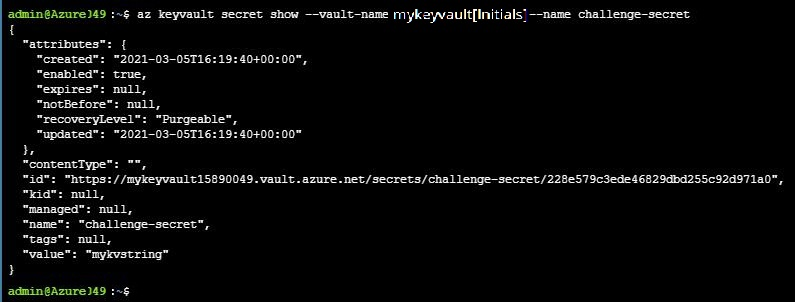
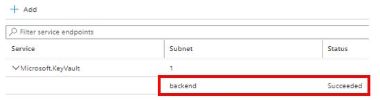
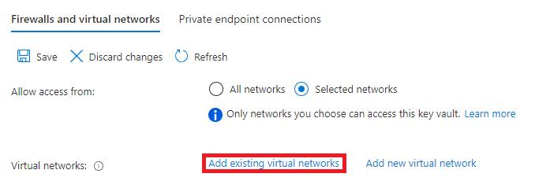
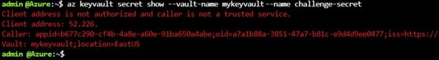
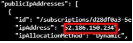

# Configure a Virtual Network Service Endpoint


## Challenge Overview

## Understand the scenario

You are an Azure® administrator. You need to configure access to an Azure Key Vault service endpoint from the back-end tier of an application. First, you will create a secret in a key vault, and then you will create an outbound security rule for the back-end subnet in a virtual network. Next, you will configure a virtual network service endpoint to provide access to the key vault secret. Finally, you will verify that you can access the service endpoint.

## Understand your environment
You will be using an Azure environment that contains a resource group named **RG6**, a storage account named **sa[Initials]**, a virtual network named **VNET**, a key vault named **mykeyvault[Initials]**, and two virtual machines named **VM1** (linux ubuntu 18.04 10.1.0.4) and **VM2** (linux ubuntu 18.04 10.1.1.4).

<u>Vnet Address Space:</u>

```
10.1.0.0/16 10.1.0.0 - 10.1.255.255 65536
```

<u>Subnets</u>

```
frontend 10.1.0.0/24

backend  10.1.1.0/24
```

> Important: **do not start** until these resources have been created, you will not be guided through these tasks. 


# Create a secret in an Azure key vault
- Sign in to the Azure portal as as your user account and password.

- Create a new secret in the **mykeyvault[Initials]** key vault by using challenge-secret as the name and **mykvstring** as the value.

  - On the Azure portal home page, select **Resource groups**, and then select **RG6**.

  - On the RG6 page, select **mykeyvault[Initials]**.

  - On the RG6 resource menu, in Settings, select **Secrets**, and then on the command bar, select **Generate/Import**.

  - On the Create a secret blade, in Name, enter challenge-secret, in Value, enter **mykvstring**, and then select **Create**.


- Configure an Azure Cloud Shell **Bash** session by using the **RG6cs** resource group, an storage account named **sacloudshell[initial]** in the **East US** region, and a new file share named **cloud-shell-share**. If the previous resources do not exist, then create then.

  - In the Cloud Shell window, select **Bash**, and then select **Show advanced settings**.

  - In Cloud Shell region, ensure that **East US** is selected.

  - In Resource group, ensure that **RG6cs** is selected.

  - In Storage account, ensure **sacloudshell[initial]** is selected.

  - In File share, ensure **cloud-shell-share** is selected.

  - Select **Create storage** to mount the storage account.


- Display the secret value by using the [az keyvault secret show](https://docs.microsoft.com/en-us/cli/azure/keyvault/secret?view=azure-cli-latest#az_keyvault_secret_show) command.

  - In Cloud Shell, run the following command to verify that the secret name and value are configured correctly and are and accessible:

    ```
    az keyvault secret show --vault-name mykeyvault[Initials] --name challenge-secret
    ```


  - You can use the az keyvault secret show command to verify that the name and value of the secret were assigned correctly and that the secret is accessible. The output of the az keyvault secret show command should look similar to the following screenshot:

    


  - Close the **Cloud Shell** window.


## Check your work

- [ ] Confirm that you created a new secret in the **mykeyvault[Initials]** key vault by using challenge-secret as the name and **mykvstring** as the value.
- [ ] Confirm that you created a Bash session in Cloud Shell.
- [ ] Confirm that you displayed the value of the secret.

# Configure an outbound security rule for a back-end subnet

- Verify that the **backend** subnet in **VNET** has a **Microsoft.KeyVault** service endpoint enabled and displays a status of **Succeeded**.
  - On the Virtual networks page, select **VNET**.
  - On the VNET resource menu, in Settings, select **Service endpoints**.
  - On the Service endpoints page, expand **Microsoft.KeyVault**, and then verify that the status of the **backend** subnet is **Succeeded**.



- Create an outbound security rule in the **webapp-nsg** network security group by using the values in the following table. For any property that is not specified, use the default values.

    | Property                | Value           |
    | :---------------------- | :-------------- |
    | Source                  | **Service Tag** |
    | Source service tag      | VirtualNetwork  |
    | Destination             | **Service Tag** |
    | Destination service tag | AzureKeyVault   |
    | Destination port ranges | *               |
    | Priority                | 100             |
    | Name                    | AllowKeyVault   |

    - In the upper-left corner, select **Home** to return to the Azure portal home page.
    - On the Azure portal home page, select **Resource groups**, and then select **RG6**.
    - On the RG6 page, select **webapp-nsg**.
    - On the webapp-nsg resource menu, in Settings, select **Outbound security rules**, and then on the command bar, select **Add**.
    - On the Add outbound security rule blade, in Source, select **Service Tag**, and then in Source service tag, search for and select VirtualNetwork.
    - In Destination, select **Service Tag**, and then in Destination service tag, search for and select AzureKeyVault.
    - In Destination port ranges, enter *.
    - In Priority, enter 100.
    - In Name, enter AllowKeyVault.
    - Review the remaining default values, and then select **Add**.


> Remember: Wait for the rule creation to finish before moving on to the next step.
>

## Check your work

- [ ] Confirm that you created an outbound security rule in **webapp-nsg** that is configured to allow outbound traffic from VNET to the **AzureKeyVault**.

# Configure a virtual network service endpoint

- Configure the **mykeyvault[Initials]** key vault to allow access from only the **backend** subnet in **VNET**.

  - On the breadcrumb menu, select **RG6**, and then select **mykeyvault[Initials]**.


  - On the mykeyvault[Initials] resource menu, in Settings, select **Networking**.


  - On the Networking page, in Allow access from, select **Selected networks**, and then select **Add existing virtual networks**.

    


  - On the Add networks blade, in Virtual networks, select the **VNET** check box, and then press **Tab**.

  - In Subnets, select the **backend** check box, and then select **Add**.

  - On the command bar, select **Save**.


- Open **Cloud Shell**, and then run the following command to attempt to display the value of the key vault secret:

- ```bash
  az keyvault secret show --vault-name mykeyvault[Initials] --name challenge-secret
  ```

- The error in the following screenshot is expected because the key vault is configured to allow access from only the specified virtual network and subnet:



	> Leave the **Cloud Shell** window open for the next task.

## Check your work

- [ ] Confirm that you configured **mykeyvault[Initials]** to allow access from only the **back-end** subnet in VNET.
- [ ] Confirm that you used the **az keyvault secret** show command to verify that you cannot access the key vault secret value.

# Verify that you can access the service endpoint

- Determine the **public IP address** of **VM2** by using the [az vm list-ip-addresses](https://docs.microsoft.com/en-us/cli/azure/vm?view=azure-cli-latest#az_vm_list_ip_addresses) command, and then record the public IP address in the following **VM2 Public IP Address** text box:

  **VM2 Public IP Address**

  ```
  ```

  - In Cloud Shell, run the following command to determine the public IP address of VM2, and then record it in the **VM2 Public IP Address text box**:

    ```bash
    az vm list-ip-addresses -g RG6 -n VM2
    ```

  - The following screenshot shows the output of the command:

    
  
	  > You will use the public IP address of VM2 in the next step.

- In Cloud Shell, create a [secure shell (SSH)](https://docs.microsoft.com/en-us/azure/virtual-machines/linux/mac-create-ssh-keys#ssh-into-your-vm) connection to VM2 by using azureadmin@<PIP>, and then when prompted, enter AzurePassw0rd! as the password.

  - Run the following command to connect to the Linux virtual machine:

    ```bash
    ssh azureadmin@<PIP>

  - When prompted, enter yes, and then press **Enter**.
  
  - In azureadmin's password, enter AzurePassw0rd!, and then press **Enter**.
  
    > Because this is a Linux virtual machine, you will not see the password displayed in Cloud Shell.
  
- Install the Azure command-line interface (CLI) on **VM2** by using the [curl](http://manpages.ubuntu.com/manpages/focal/en/man1/curl.1.html) command piped to the [sudo](http://manpages.ubuntu.com/manpages/focal/en/man8/sudo.8.html) [bash](http://manpages.ubuntu.com/manpages/focal/en/man1/bash.1.html) command.

  - Run the following command to install the Azure CLI:

    ```bash
    curl -sL https://aka.ms/InstallAzureCLIDeb | sudo bash

  - You need to install the [Azure CLI](https://docs.microsoft.com/en-us/cli/azure/install-azure-cli-linux?pivots=apt) on VM2 to complete the remaining steps in this task.

  - Sign in to the Azure CLI with your user and password account [az login](https://docs.microsoft.com/en-us/cli/azure/reference-index?view=azure-cli-latest#az_login) command.


  - In  VM2's bash shell , run the following command to display the value of the key vault secret:

    ```
    az keyvault secret show --vault-name mykeyvault[Initials] --name challenge-secret
    ```

    > You can display the value of the key vault secret because VM2 is associated to the back-end subnet in VNET, and you configured the key vault to allow access from the back-end subnet.

## Check your work

- [ ] Confirm that you recorded the public IP addresses of **VM2**.
- [ ] Confirm that you connected to **VM2** by using SSH.
- [ ] Confirm that you installed the Azure CLI on **VM2**.
- [ ] Confirm that you used the **az keyvault** secret show command from an Azure CLI session in **VM2** to verify that you can access the value of the key vault secret.

# Summary

Congratulations, you have completed the **Configure a Virtual Network Service Endpoint** challenge.

In this challenge, you accomplished the following:

- Created a secret in an Azure key vault.
- Created an outbound security rule for a back-end subnet.
- Configured a virtual network service endpoint.
- Verified access to the service endpoint.