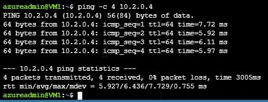

# Configure Global Virtual Network Peering


## Challenge Overview

## Understand the scenario
You are an Azure® administrator responsible for managing a virtual network. You need to configure a virtual network peering between the virtual networks for two applications hosted in different Azure regions. First, you will review existing Azure resources, and then you will verify that you are unable to add virtual network peerings between the existing virtual networks. Next, you will remove overlapping address spaces in the virtual network configuration. Finally, you will configure global virtual network peering between the two virtual networks.

## Understand your environment
You will be creating an Azure resource group named **RG7** that contains an existing storage account named sa[Initials] for use with Cloud Shell, two virtual networks named **VNET** (East US)  and **VNET2** (East US 2), both with Address space 10.1.0.0/16 and  subnet 1 10.1.0.0./24, and two virtual machines named **VM1** (East US) and **VM2** (East US 2).

> Important: **do not start** until these resources have been created, you will not be guided through these tasks. 

# Review the created Azure resources

- Sign in to the Azure portal as as your user account and password.

  - Record the public IP address of **VM1** in the following Public IP Address text box:


  - Public IP Address

    ```
    ```
    


> Remember: You will use the public IP address in an upcoming task.

- Review the address space and subnet configurations of the **VNET1** virtual network.
  - Ensure that **VNET1** is located in the East US region and is associated to an address space of 10.1.0.0/16. VNET1 contains a subnet named subnet1 that is associated to an address range of 10.1.0.0/24.


- Review the address space and subnet configurations of **VNET2**.
  - Ensure that **VNET2** is located in the East US 2 region and is associated to an address space of 10.1.0.0/16, which overlaps with **VNET1**. **VNET2** contains a subnet named subnet1 that is associated to an address range of 10.1.0.0/24.


> You need to ensure that the address spaces of virtual networks that you intend to connect do not overlap. You will correct this in an upcoming task.

## Check your work

- [ ] Confirm that you recorded the public IP address of **VM1**.
- [ ] Confirm that you reviewed the virtual network configurations of **VNET1** and **VNET2**.

# Add a virtual network peering

- Add two virtual network peerings named **VNET2-to-VNET** and **VNET1-to-VNET2** to the **VNET2** virtual network.

  - On the **VNET2** resource menu, in Settings, select *Peerings*, and then on the command bar, select Add.


  - In This virtual network, in Peering link name, enter **VNET2-to-VNET1**.


  - In Remote virtual network, in Peering link name, enter **VNET1-to-VNET2**.


  - In Virtual network, select VNET1, and then select Add.

  - When the error notification is displayed, close the **Add peering** blade.


- An error is expected because the address spaces overlap between the virtual networks.

- A virtual network peering will allow traffic to flow in both directions between the **VNET1** and **VNET2** virtual networks.

> Remember: You can use a virtual network peering to connect virtual networks together. For connectivity purposes, Azure will view the connected networks as if they are one network, and traffic will be routed between the peered virtual networks across the Microsoft backbone rather than through a gateway. For this reason, traffic between peered virtual networks will never traverse the public internet.

- You can choose between two types of peering:

  - Virtual network peering connects virtual networks in the same region.

  - Global virtual network peering connects virtual networks in different regions.
    You can use user-defined routes to implement service chaining by configuring a virtual machine in the peered virtual network as the next hop IP address.


- You can also configure a gateway in a peered virtual network as a transit point to an on-premises network. This is referred to as gateway transit.

## Check your work

- [ ] Confirm that you were unable to create virtual network peerings between **VNET1** and **VNET2**.

# Remediate overlapping address spaces

- Add an address space of 10.2.0.0/16 to VNET2.

  - On the VNET2 resource menu, in Settings, select **Address space**.

  - On the Address space page, in Add additional address range, enter 10.2.0.0/16, and then select **Save**.


- Add a subnet named subnet2 to **VNET2** by using a subnet address range of 10.2.0.0/24 .

  - On the VNET2 resource menu, in Settings, select **Subnets**.

  - On the Subnets page, on the command bar, select **Subnet**.

  - On the Add subnet blade, in Name, enter subnet2.

  - In Subnet address range, enter 10.2.0.0/24, select **Save**, and then if needed, close the **Add subnet** blade.


> Remember: When you create a new subnet, you must enter an address range that falls within one of the address spaces you have defined for the virtual network.

- When you design the address ranges of your subnets, remember that the first three IP addresses in each subnet are reserved by Azure for internal use.

- Associate **VM2-nic** to subnet2 in **VNET2**.

  - In the upper-left corner, select Home to return to the Azure portal home page.


  - On the Azure portal home page, select Resource groups, select RG7, and then select VM2-nic.


  - On the VM2-nic resource menu, in Settings, select IP configurations.


  - On the IP configurations page, in Subnet, select subnet2, and then select Save.


> Warning: Ensure that you saved the IP configuration settings before proceeding to the next step.

- Delete **subnet1** in **VNET2**.

  - On the IP configurations page, select **VNET2**.

  - On the **VNET2** resource menu, in Settings, select Subnets.


  - On the Subnets page, ensure that subnet1 is selected, and then on the command bar, select Delete.
    In the Delete subnet dialog box, select Yes.


- Delete the **10.1.0.0/16** address space in **VNET2**.

  - On the **VNET2** resource menu, in Settings, select Address space.


  - In the 10.1.0.0/16 address space row, select the Delete icon, and then select Save.


## Check your work

- [ ] Confirm that you created an address space of 10.2.0.0/16 in **VNET2**.

- [ ] Confirm that you created a subnet named subnet2 in **VNET2**.

  

# Configure a global virtual network peering

- Add two virtual network peerings named VNET2-to-VNET1 and VNET1-to-VNET2 to **VNET2**.
- Verify that the peering status of VNET2-to-VNET1 is **Connected**.
  - On the VNET2 Peerings page, in the Peering status column, ensure that the status of VNET2-to-VNET1 is **Connected**.

- Verify that the peering status of VNET1-to-VNET2 is **Connected**.

- Configure an Azure Cloud Shell **Bash** session by using the existing **RG7** resource group, an existing storage account named **sa[Initials]** in the **East US** region, and a new file share named cloud-shell-share.

  - In the Cloud Shell window, select **Bash**, and then select **Show advanced settings**.

  - In Cloud Shell region, ensure that **East US** is selected.

  - In Resource group, ensure that **Use existing** is selected, and then ensure that **RG7** is selected.

  - In Storage account, ensure that **Use Existing** is selected, and then ensure that **sa[Initials]** is selected.

  - In File share, select **Create new**, and then enter cloud-shell-share.

  - Select **Create storage** to mount the storage account.

- In Cloud Shell, connect to the virtual machine azureadmin@<PIP> by using a [secure shell (SSH)](https://docs.microsoft.com/en-us/azure/virtual-machines/linux/mac-create-ssh-keys#ssh-into-your-vm) connection, and then when prompted, enter AzurePassw0rd! as the password.

  - In Cloud Shell, run the following command to connect to the Linux virtual machine:

    ```bash
    ssh azureadmin@<PIP>

  - When prompted, enter yes, and then press **Enter**.

  - In azureadmin@<PIP>'s password, enter AzurePassw0rd!, and then press **Enter**.


- Because this is a Linux virtual machine, you will not see the password displayed in Cloud Shell.

  - Verify that VNET1 and VNET2 are connected by using the [ping](https://docs.microsoft.com/en-us/windows-server/administration/windows-commands/ping) command to 10.2.0.4.

    - Run the following command to verify that VNET1 and VNET2 are connected:

      ```
      ping -c 4 10.2.0.4
      ```

      The output of the command should look similar to the following screenshot:

      


  - Close the **Cloud Shell** window.


## Check your work

- [ ] Confirm that you added two virtual network peerings named VNET2-to-VNET1 and VNET1-to-VNET2 to the VNET2 virtual network.
- [ ] Confirm that you created a Bash session in Cloud Shell.
- [ ] Confirm that you connected to VM1 by using SSH.
- [ ] Confirm that you verified network peering connectivity between VNET1 and VNET2 by using the Ping command.

# Summary

Congratulations, you have completed the **Configure Global Virtual Network Peering** challenge.

In this challenge, you accomplished the following:

- Reviewed existing Azure resources.
- Added a virtual network peering.
- Remediated overlapping address spaces.
- Configured global virtual network peering.
